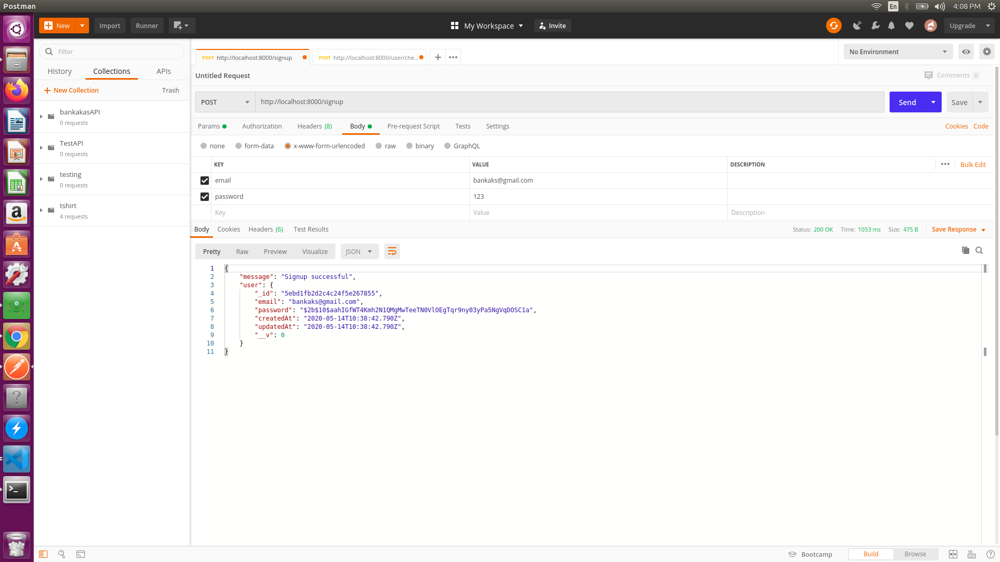
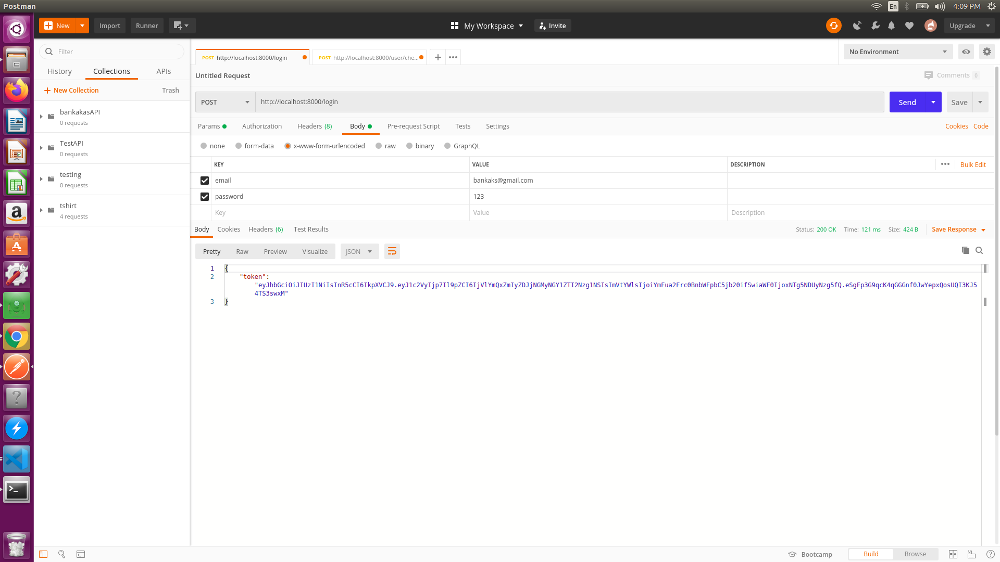
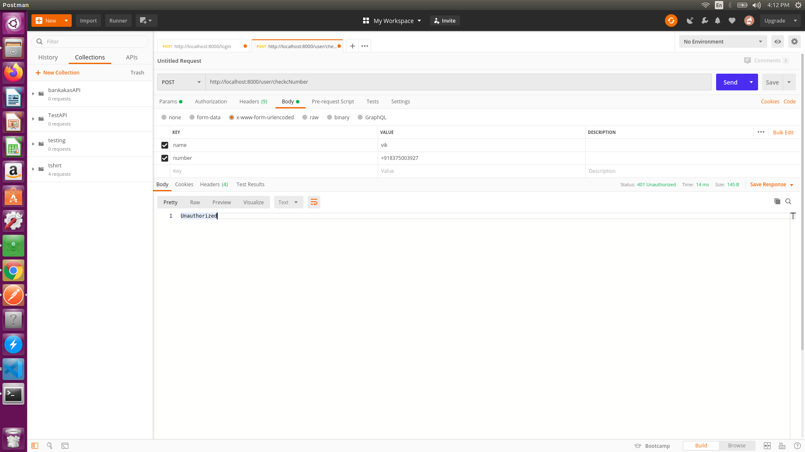
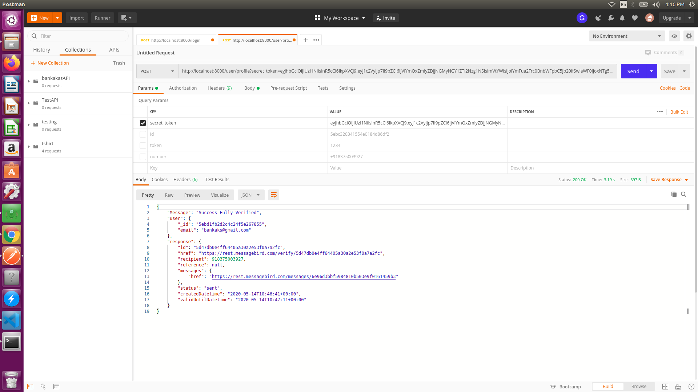

# -BankaksAPI
verify using otp| messagebird API
# -BankaksAPI
verify using otp| messagebird API
#TASK
1. Public endpoints for user sign-up and user login. The required inputs will be
mobile number and password. The response of both APIs should have a JWT
token or any other data for authentication. You can implement the Authentication
approach you are must familiar with.

2. A post endpoint to add contacts by providing their name and mobile number.
Before saving the contact in the database, you should make a call to Message
Bird Lookup API1 in order to validate that the number is valid and only save it if
it is. This endpoint should be secured, meaning that only authenticated users will
be able to save contacts.

# Use this API
1. clone it
2. npm install
3. npm start

#Routes
1. SignUp
http://localhost:8000/signup

2. login
http://localhost:8000/login

3. unauthorized
http://localhost:8000/login

4.user has been verified
http://localhost:8000/user/profile?secret_token="key"

you will get the response after sending the OTP, only authorized user will recieve the otp and verify the number.

